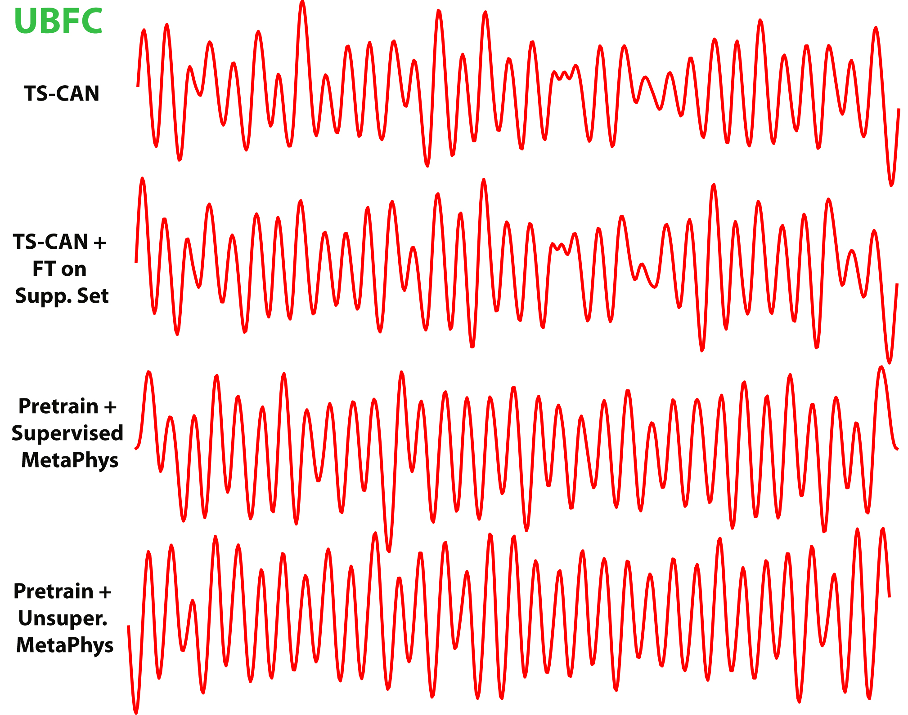
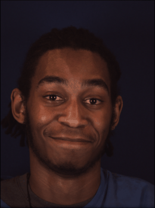
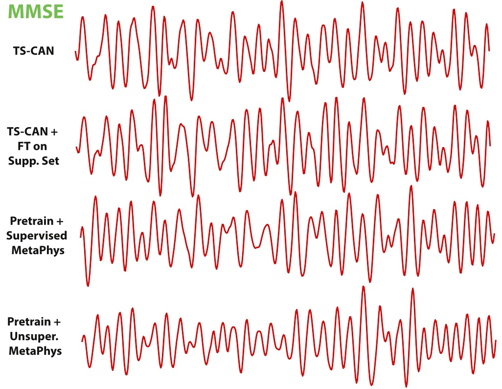

# MetaPhys
Paper Title: MetaPhys: Unsupervised Few-Shot Adaptation for Non-Contact Physiological Measurement Review Under ICLR 2021

# Sample Waveforms 

## UBFC 

## MMSE 

# Acknowledgement 

MetaPhys's dataloading schema is based on pytorch-meta (https://github.com/tristandeleu/pytorch-meta), and our inner/outer loop optimizaton is based on higher (https://github.com/facebookresearch/higher). 

